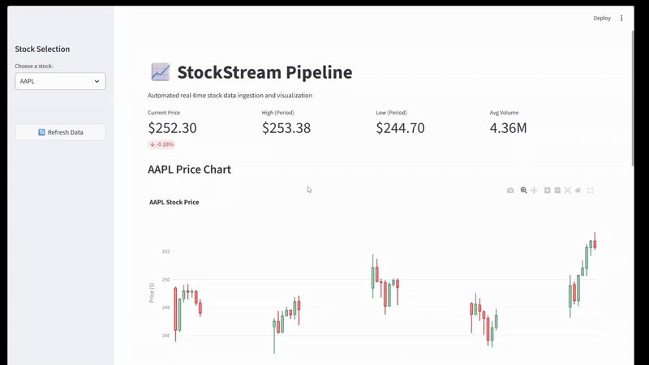

# StockStream-Pipeline
Real-Time Stock Data ETL System

Automated real-time stock data pipeline with PostgreSQL storage and interactive Streamlit dashboard.

## Overview
A production-ready ETL pipeline that:
- Ingests stock market data every 15 minutes via yfinance API
- Stores data in PostgreSQL with proper schema design
- Provides real-time visualization through Streamlit
- Demonstrates core data engineering principles

## Tech Stack
- **Backend**: Python, SQLAlchemy, PostgreSQL
- **Data Source**: yfinance
- **Visualization**: Streamlit, Plotly
- **Automation**: Python scheduling

## Setup
1. Install dependencies: `pip install -r requirements.txt`
2. Configure database in `.env` file
3. Initialize database: `python src/database/init_db.py`
4. Run pipeline: `python run_pipeline.py`
5. Start dashboard: `streamlit run src/dashboard/app.py`

## Project Structure
- `src/ingestion/` - Data collection
- `src/database/` - Database models and connections
- `src/dashboard/` - Streamlit visualization
- `run_pipeline.py` - Single execution
- `auto_pipeline.py` - Continuous automation

## Demo

Here is a short demo showcasing the primary features and capabilities of 
   using the data from the pipeline.

